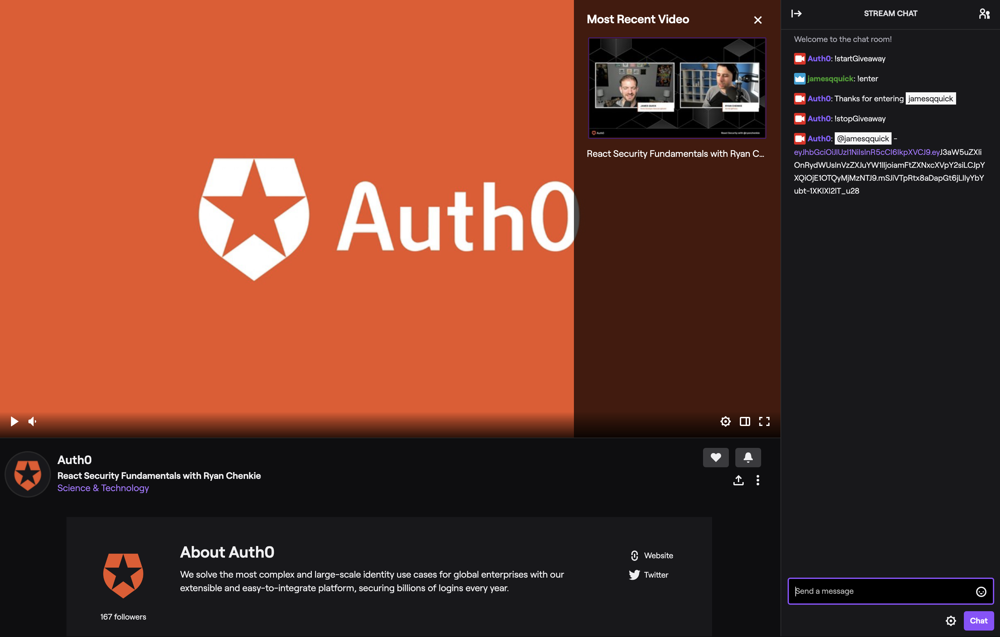
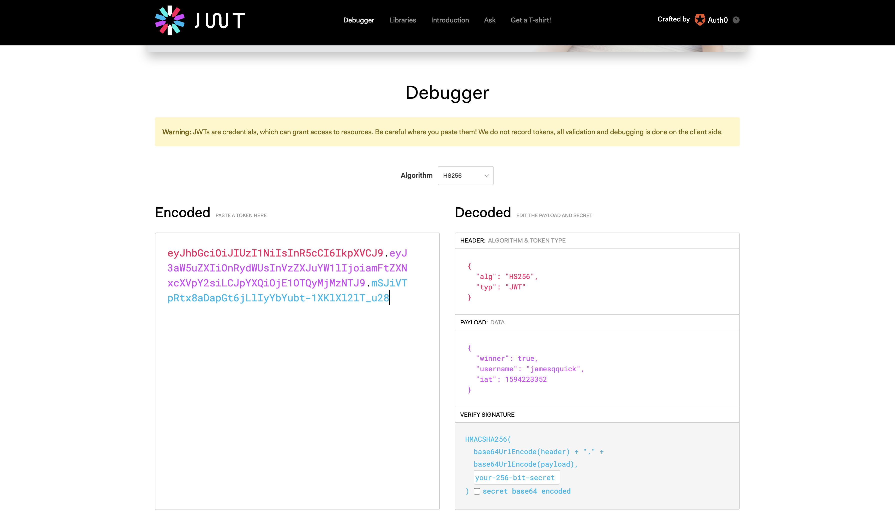
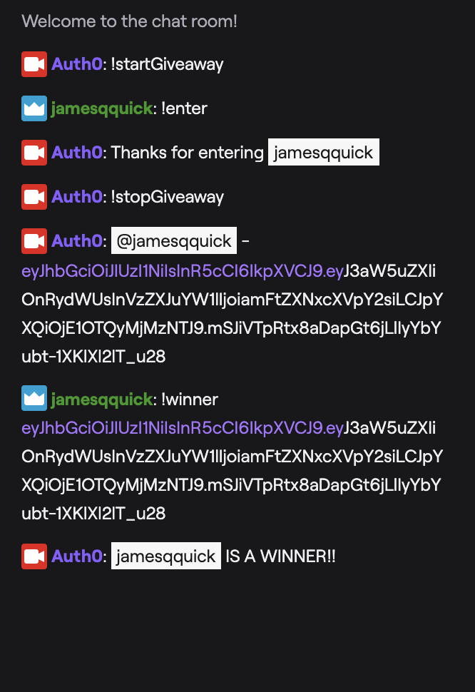

# JWT Twitch Giveaway Bot

This Twitch Bot is used to facilitate a giveaway by generating JSON Web Tokens for each entered user.

## How it Works

The admin controls the timeframe to accept entries with the `!startGiveaway` and `!stopGiveaway` commands. Users can then enter the giveaway with the `!enter` command.

After the admin decides to stop accepting entries, a JSON Web Token (JWT) is generated for each user that entered. A message will be posted in the chat tagging the user and including their respective token. Ideally, this should be done using Whispers (private messages), but there are limitations in automating those. If you have a suggestion on how this would work, please let me know :)

Embedded in each JWT is a `user` property and a `winner` property that let's the user know whether or not they are a winner. To decode the token, users can paste it into [JWT.io](jwt.io).

If the user thinks they are a winner, they can respond back in the chat using the command `!winner` followed by a space and then their token. The chat bot will be able to validate this token to determine whether the token is a valid token and also has the appropriate `winner` and `username` properties.

## How to Run

Create a `.env` file with the same properties that are in the `.env.example` file. You'll need to fill these properties in with your personal credentials.

You can create a Twitch token [here](https://twitchapps.com/tmi/);

Then, when you are ready, run the bot.

`node twitchChatBot.js`
